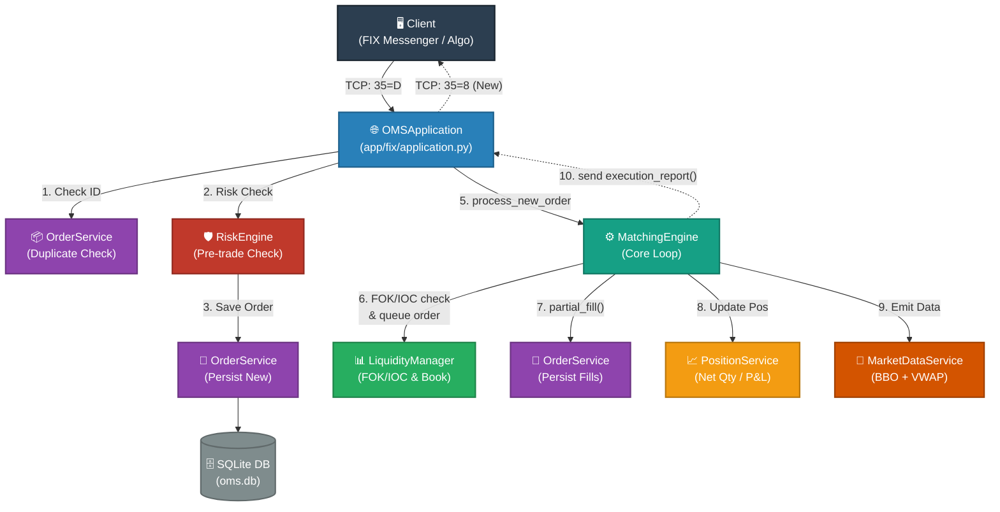

# FIX OMS — Order Management System

A FIX 4.4 Order Management System built in Python. It accepts connections from multiple trading clients simultaneously, runs pre-trade risk checks, matches orders using price-time priority, tracks positions and P&L, and maintains a live market data snapshot — all over the FIX protocol.

---

## What It Does

- Accepts FIX 4.4 connections from multiple clients (CLIENT, CLIENT2, PRIME)
- Handles New Order (35=D), Cancel (35=F), Cancel/Replace (35=G), and Mass Cancel (35=q)
- Runs pre-trade risk checks before accepting any order
- Supports LIMIT and MARKET order types with Day, IOC, and FOK time-in-force
- Matches buy and sell orders using price-time priority
- Tracks per-client positions and realized P&L after every fill
- Maintains a live market data snapshot (last price, VWAP, volume, high/low, BBO)
- Persists all orders and executions to a SQLite database
- Sends Execution Reports (35=8), Cancel Rejects (35=9), Mass Cancel Reports (35=r), and Position Reports (35=AP) back to clients
- Extracts and echoes party identification (broker, trader, client) from incoming orders

---

## Project Structure

```
FIX OMS/
├── oms.py                          ← Entry point — starts the FIX acceptor
├── oms.db                          ← SQLite database (auto-created on first run)
├── requirements.txt
├── config/
│   ├── server.cfg                  ← FIX session config (port, sessions, heartbeat)
│   ├── client.cfg                  ← Config for connecting a test client
│   ├── client2.cfg
│   └── spec/
│       └── FIX44.xml               ← FIX 4.4 data dictionary
├── app/
│   ├── fix/
│   │   └── application.py          ← Core FIX application (routes all messages)
│   ├── services/
│   │   ├── order_service.py        ← Order CRUD and fill logic
│   │   ├── matching_engine.py      ← Price-time priority matching
│   │   ├── risk_engine.py          ← Pre-trade risk checks
│   │   ├── position_service.py     ← Position and P&L tracking
│   │   ├── market_data_service.py  ← VWAP, volume, BBO updates
│   │   ├── execution_service.py    ← Execution record management
│   │   └── order_state_machine.py  ← Valid order status transitions
│   ├── models/
│   │   ├── order.py                ← Order table
│   │   ├── execution.py            ← Execution/fill table
│   │   ├── position.py             ← Position table
│   │   └── market_data.py          ← Market data snapshot table
│   ├── core/
│   │   ├── liquidity_book.py       ← In-memory order book (bids/asks)
│   │   └── logger.py               ← Shared logger setup
│   ├── db/
│   │   ├── database.py             ← SQLAlchemy engine and session factory
│   │   └── base.py                 ← Declarative base for all models
│   ├── mapping/
│   │   └── fix_mapper.py           ← Converts FIX message fields to Order objects
│   └── repository/
│       └── order_repository.py     ← Low-level order DB queries
├── store/                          ← FIX message store (auto-created)
└── logs/                           ← FIX session logs (auto-created)
```

```
## Setup

**Requirements:** Python 3.9+

```bash
# 1. Create and activate a virtual environment
python -m venv .venv
.venv\Scripts\activate        # Windows
source .venv/bin/activate     # Linux / macOS

# 2. Install dependencies
pip install -r requirements.txt

# 3. Run the OMS
python oms.py
```

When it starts you should see:

```
Initializing database...
--- FIX OMS STARTED ---
Listening for client connections...
Multi-client support: YES  |  Risk checks: YES  |  Positions: YES
```

---

## Configuration

The FIX session config lives in `config/server.cfg`. The OMS listens on port **9878** and supports three pre-configured sessions:

| SenderCompID | TargetCompID | Description |
|---|---|---|
| OMS | CLIENT | Primary trading client |
| OMS | CLIENT2 | Second trading client |
| OMS | PRIME | Prime broker / institutional |

To add a new client, add a new `[SESSION]` block to `server.cfg` with the desired `TargetCompID`. No code changes needed.

---

## Supported FIX Messages

### Incoming (from client → OMS)

| MsgType | Name | Description |
|---|---|---|
| 35=D | New Order Single | Place a new buy or sell order |
| 35=F | Order Cancel Request | Cancel an existing active order |
| 35=G | Order Cancel/Replace | Modify the price or quantity of an active order |
| 35=q | Order Mass Cancel Request | Cancel all active orders, or all orders for a specific symbol |
| 35=AN | Position Request | Request current position and P&L for all held symbols |

### Outgoing (from OMS → client)

| MsgType | Name | When sent |
|---|---|---|
| 35=8 | Execution Report | Order accepted, filled, cancelled, replaced, or rejected |
| 35=9 | Order Cancel Reject | Cancel or replace request was rejected |
| 35=r | Order Mass Cancel Report | Confirms the result of a mass cancel request |
| 35=AP | Position Report | One report per position in response to a 35=AN request |

---

## Order Types and Time-in-Force

### Order Types (Tag 40)

| Value | Type | Behaviour |
|---|---|---|
| 1 | Market | Executes immediately at the best available price |
| 2 | Limit | Executes only at the specified price or better |

### Time-in-Force (Tag 59)

| Value | TIF | Behaviour |
|---|---|---|
| 0 | Day | Rests in the order book until filled or cancelled |
| 3 | IOC | Fill as much as possible immediately; cancel the remainder |
| 4 | FOK | Fill the entire quantity immediately or cancel the whole order |

---

## Order Lifecycle

```
Client sends 35=D
       ↓
Risk check (qty, price, notional, position limit)
       ↓ fail               ↓ pass
35=8 REJECTED          35=8 NEW sent to client
                              ↓
                     Matching engine checks order book
                     ↓ match found         ↓ no match
               35=8 FILL sent         Order queued in book
               position updated       (waits for counterpart)
               market data updated
```

After a cancel:
```
Client sends 35=F with OrigClOrdID
       ↓ order found and active    ↓ order already done
35=8 CANCELED sent               35=9 CANCEL REJECT sent
                                  with reason text
```

After a mass cancel:
```
Client sends 35=q
       ↓
OMS cancels all matching active orders (by symbol or all)
       ↓
35=8 CANCELED sent for each affected order
35=r Mass Cancel Report sent with TotalAffectedOrders count
```

---

## Risk Checks

Every order passes through the risk engine before being accepted. The default limits are:

| Check | Default Limit |
|---|---|
| Maximum order quantity | 100,000 shares |
| Maximum order notional value | £10,000,000 |
| Maximum net position per symbol | ±500,000 shares |
| Minimum price | 0.0001 |
| Maximum price | 999,999.00 |

To apply different limits to a specific client, add an entry to `CLIENT_LIMITS` in `app/services/risk_engine.py`:

```python
CLIENT_LIMITS = {
    "CLIENT2": {
        "max_order_value": 5_000_000,
        "max_position_qty": 100_000,
    }
}
```

---

## Order Matching

The matching engine uses **price-time priority**:

- Bids are sorted highest price first, then oldest first at the same price.
- Asks are sorted lowest price first, then oldest first.
- A match happens when an incoming buy price is >= the best ask, or an incoming sell price is <= the best bid.
- The match price is always the resting order's price.
- Partial fills are supported — the unfilled remainder stays in the book.

---

## Party Identification

Orders can include a `NoPartyIDs` repeating group (Tag 453) to identify the parties involved. The OMS extracts these on inbound orders and echoes them back on Execution Reports.

| Tag | Name | Description |
|---|---|---|
| 453 | NoPartyIDs | Number of parties in the group |
| 448 | PartyID | The identifier string (e.g. broker name, trader ID) |
| 447 | PartyIDSource | Format of the ID — `D` = Proprietary/Custom |
| 452 | PartyRole | Role of the party (see table below) |

Supported party roles:

| Role Value | Meaning | Stored As |
|---|---|---|
| 1 | Executing Firm / Broker | `broker_id` |
| 3 | Client ID | `client_ref` |
| 11 | Order Originator (Trader) | `trader_id` |
| 36 | Entering Trader | `trader_id` |

The OMS always echoes itself as an Executing Firm (Role=1, ID=`MY_CUSTOM_OMS`) on every outbound Execution Report.

---

## Database

The OMS uses **SQLite** (`oms.db`) via SQLAlchemy. Tables are created automatically on startup.

| Table | Contents |
|---|---|
| `orders` | Every order with full state (status, filled qty, avg price) |
| `executions` | Every individual fill event |
| `positions` | Per-client, per-symbol net position and P&L |
| `market_data` | Latest price snapshot per symbol |

---

## FIX Tag Reference

Common tags used throughout the system:

| Tag | Name | Values |
|---|---|---|
| 35 | MsgType | D=New, F=Cancel, G=Replace, q=MassCancel, 8=ExecReport, 9=CancelReject, r=MassCancelReport, AP=PositionReport |
| 11 | ClOrdID | Unique order ID assigned by the client |
| 41 | OrigClOrdID | The ClOrdID of the order being cancelled or replaced |
| 49 | SenderCompID | Who sent the message (e.g. CLIENT) |
| 54 | Side | 1=Buy, 2=Sell |
| 55 | Symbol | Instrument ticker (e.g. AAPL) |
| 38 | OrderQty | Number of shares |
| 40 | OrdType | 1=Market, 2=Limit |
| 44 | Price | Limit price |
| 59 | TimeInForce | 0=Day, 3=IOC, 4=FOK |
| 39 | OrdStatus | 0=New, 1=PartFill, 2=Filled, 4=Canceled, 8=Rejected |
| 150 | ExecType | 0=New, F=Trade, 4=Canceled, 5=Replaced, 8=Rejected |
| 14 | CumQty | Total quantity filled so far |
| 151 | LeavesQty | Quantity still open |
| 6 | AvgPx | Average fill price |
| 58 | Text | Reject reason or informational message |
| 103 | OrdRejReason | 6=Duplicate order |
| 453 | NoPartyIDs | Count of parties in the repeating group |
| 448 | PartyID | Party identifier string |
| 447 | PartyIDSource | D=Proprietary/Custom |
| 452 | PartyRole | 1=Broker, 3=Client, 11=Trader |
| 530 | MassCancelRequestType | 1=Cancel by Symbol, 7=Cancel All |
| 531 | MassCancelResponse | Echoes the request type in the report |
| 533 | TotalAffectedOrders | Number of orders cancelled by mass cancel |
| 702 | NoPositions | Repeating group count for position quantities |
| 703 | PosType | TQ=Transaction Quantity (net position) |
| 704 | LongQty | Shares held long (positive side of net position) |
| 705 | ShortQty | Shares held short (absolute value of negative position) |
| 753 | NoPosAmt | Repeating group count for position monetary amounts |
| 707 | PosAmtType | CASH=Cash amount associated with the position |
| 708 | PosAmt | Cash value of the position (monetary amount) |

---


## Dependencies

```
sqlalchemy==2.0.47
quickfix==1.15.1
```

QuickFIX must be installed from a `.whl` file matching your Python version and OS if a binary is not available via pip. Check the QuickFIX Python documentation for the correct wheel file.
